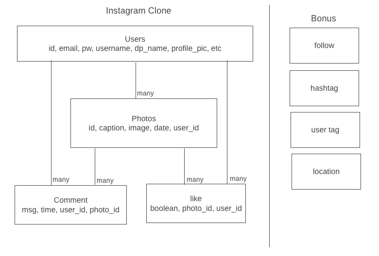

# Clonestagram
Create a simple CRUD system with Ruby on rails to create a similar application like instagram. The application is not yet complete. Feature of the application will be added and imrove further.

## :computer: live project! [Coming soon](#) 

## :page_facing_up: About
- Download instructions (if relevant):
```zsh
$ git clone clonestagram
$ cd clonestagram
$ rails server
```
- Get to http://localhost:3000/
- You will be redirect to sign up page.
- CLick 'sign up' to sign up for your account.
- once it is sign up, click profile to add more detail for your profile.
- click create to add photo to your profile.
- Home show phtos from all users. It will limit to user that you follow in future update.

## :pencil2: Planning
- Database draft of app logic.


## :rocket: Cool tech
- close enough CSS to match actual instagram

## :scream: Bugs to fix
- A lot more features are to be added
- Restriction on user need to be implemented
- Like function is missing
- comment feature is missing
- Photos upload function will be added.

## :sob: Lessons learnt
- A better planning of project and schedule are required.
- add one feature at a time and focus on it to avoid confusion.
- A deeper understand on its material would help getting project done smoother.

## :white_check_mark: Future features
Hoping to make a functionally real close app like instagram.